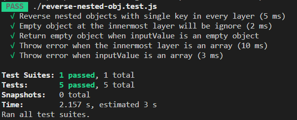

# Reverse Nested Objects
## Question
```javascript
// Please write a function to reverse the following nested input value into output value

// Input:
let inputValue = {
  hired: {
    be: {
      to: {
        deserve: 'I'
      }
    }
  }
};

// Output:
let outputValue = {
  I: {
    deserve: {
      to: {
        be: 'hired'
      }
    }
  }
};
```

## Unit Test
The unit test contains 5 scenerios: 

:ballot_box_with_check: Reverse nested objects with single key in every layer

:ballot_box_with_check: Empty object at the innermost layer will be ignore

:ballot_box_with_check: Return empty object when inputValue is an empty object

:ballot_box_with_check: Throw error when the innermost layer is an array

:ballot_box_with_check: Throw error when inputValue is an array

### Test Result



### How to run the test

Please follow these steps to see the test results:

1. Download

   ```
   git clone https://github.com/Kaikai8888/reverse-nested-object.git
   ```

2. Install Jest

   ```bash
   npm install
   ```

3. Run test

   ```bash
   npm run test
   ```


